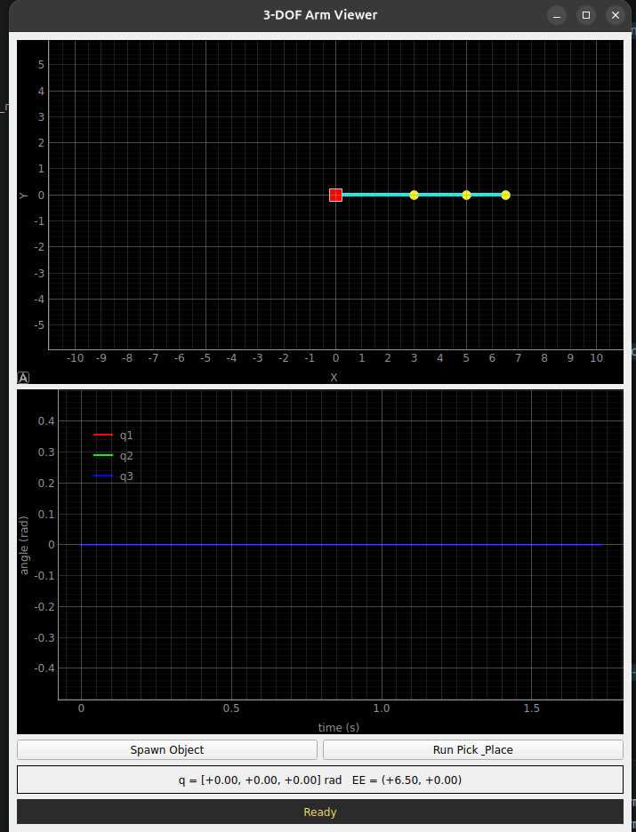

# Kineshia Robotics — ROS 2 Manipulator Take-Home

## Overview

This repository extends the original **Kineshia Robotics — ROS 2 Manipulator Take-Home** starter project.

The original task provided a working planar-arm kinematics library and starter stubs for a ROS 2 controller and PyQt5/PyQtGraph GUI. The objective was to build a complete ROS 2 software stack around the provided kinematics library.

The completed implementation provides:

* A ROS 2 controller node
* A live PyQt5 + PyQtGraph GUI
* Forward and inverse kinematics integration
* Multi-seed inverse kinematics selection
* Joint-limit and ground-constraint validation
* Smooth quintic joint-space trajectories
* Waypoint routing for difficult cross-workspace motions
* Live `/joint_states` streaming
* End-effector telemetry
* Live joint-angle plotting
* Virtual object spawning and grasp tracking
* A ROS 2 `PickAndPlace` action
* Action feedback and result handling
* Pick-and-place cancellation checks
* A hardware-swappable `JointCommandSink` abstraction
* A ROS publisher backend for the current simulation
* A placeholder Dynamixel backend for future hardware integration

The system is currently a **software simulation and visualization stack**. It does not require a physical robot, URDF, RViz, or Gazebo to demonstrate the implemented functionality.

## Quick Start

From the ROS 2 workspace:

```bash
cd /ros2_ws
colcon build --packages-select planar_arm_interfaces planar_arm_control
source install/setup.bash
ros2 launch planar_arm_control arm_demo.launch.py
```

The GUI should then open.

For the fixed demonstration scenario, use:

* **Pick:** `(4.0, 2.0)`
* **Place:** `(-3.0, 3.0)`

Click **Run Pick & Place** in the GUI to execute the complete sequence.

The edge-case test uses the requested target:

```text
(7.0, 3.0)
```

which lies outside the theoretical workspace and is handled by the workspace-boundary logic described in [§28](#28-edge-case-target-outside-workspace).

## Test Scenario From the Brief

The main end-to-end demonstration uses:

```text
Pick:
(4.0, 2.0)

Place:
(-3.0, 3.0)
```

The controller uses waypoint routing when a direct configuration-space transition is not valid.

An additional edge case tests:

```text
(7.0, 3.0)
```

which lies outside the nominal 6.5-unit workspace.

Run the application with:

```bash
ros2 launch planar_arm_control arm_demo.launch.py
```

and use the GUI to demonstrate the required behavior.

---

# 1. Original Starter Repository

The original repository provided the following structure:

```text
kineshia_ros2_arm_task/
├── README.md
└── src/
    └── planar_arm_control/
        ├── package.xml
        ├── setup.py
        ├── setup.cfg
        ├── resource/
        │   └── planar_arm_control
        ├── launch/
        │   └── bringup.launch.py
        └── planar_arm_control/
            ├── planar_arm.py
            ├── controller_node.py
            └── gui_node.py
```

The rest of this document describes the **extension built on top of this starter project**.

The provided `planar_arm.py` library was treated as a black-box kinematics library and was not modified.

It provides:

* Forward kinematics
* Analytical inverse kinematics
* Multiple IK solutions
* Damped-Jacobian fallback
* Joint limits
* Ground constraint checking

The controller and GUI files were provided as implementation stubs.

---

# 2. Arm Specification

The manipulator is a 3-DoF planar revolute arm.

| Property                  | Value                                   |
| ------------------------- | --------------------------------------- |
| Number of joints          | 3                                       |
| Link lengths              | `[3.0, 2.0, 1.5]`                       |
| Joint 1                   | `0°` to `180°`                          |
| Joint 2                   | `-120°` to `+120°`                      |
| Joint 3                   | `-120°` to `+120°`                      |
| Ground constraint         | No part of the arm may go below `y = 0` |
| Maximum theoretical reach | `6.5` units                             |

The supplied kinematics library remains unchanged.

---

# 3. Final Project Structure

The implementation adds a custom ROS 2 interface package for the pick-and-place action.

```text
kineshia_ros2_arm/
│
├── planar_arm_control/
│   ├── package.xml
│   ├── setup.py
│   ├── setup.cfg
│   ├── resource/
│   │   └── planar_arm_control
│   │
│   ├── launch/
│   │   └── arm_demo.launch.py
│   │
│   └── planar_arm_control/
│       ├── __init__.py
│       ├── planar_arm.py
│       ├── controller_node.py
│       └── gui_node.py
│
├── planar_arm_interfaces/
│   ├── package.xml
│   ├── CMakeLists.txt
│   └── action/
│       └── PickAndPlace.action
│
├── README.md
├── SIM_TO_REAL.md
├── .gitignore
└── demo.mp4
```

---

# 4. System Architecture

The final architecture is:

```text
                         /target_pose
              ┌──────────────────────────────┐
              │                              ▼
      ┌───────────────┐              ┌───────────────────┐
      │    GUI Node   │              │  Controller Node │
      │               │              │                   │
      │   PyQt5       │              │   PlanarArm       │
      │   PyQtGraph   │              │   IK              │
      │               │              │   Trajectory      │
      │   Arm View    │              │   Constraints     │
      │   Telemetry   │              │   Action Server   │
      │   Joint Plot  │              │                   │
      └───────┬───────┘              └─────────┬─────────┘
              ▲                                │
              │                                │
       /joint_states                    JointCommandSink
              │                                │
              │                       ┌────────┴─────────┐
              │                       │                  │
              │                 RosPublisherSink   DynamixelSink
              │                       │              (future)
              │                       ▼
              │                  /joint_states
              │
              │
              └──────────── /grasp_state
```

The system has two primary runtime nodes.

### `controller_node`

Responsible for:

* Owning the current arm state
* Running inverse kinematics
* Selecting valid IK solutions
* Generating trajectories
* Executing trajectories
* Publishing joint states
* Handling target commands
* Running the pick-and-place action server
* Publishing grasp state
* Providing a hardware-independent command path

### `gui_node`

Responsible for:

* Rendering the arm
* Displaying the current joint configuration
* Plotting joint angles over time
* Showing end-effector telemetry
* Spawning a virtual object
* Tracking the object during grasp
* Sending target positions
* Sending pick-and-place action goals
* Displaying action feedback and results
* Integrating ROS 2 and Qt event loops

---

# 5. ROS 2 Interfaces

## 5.1 `/joint_states`

Type:

```text
sensor_msgs/msg/JointState
```

Published by the controller at approximately 20 Hz.

The message contains:

```text
joint1
joint2
joint3
```

with the current joint positions.

The GUI subscribes to this topic and uses the received joint state as the authoritative arm state for visualization.

---

## 5.2 `/target_pose`

Type:

```text
geometry_msgs/msg/PointStamped
```

The GUI publishes a target position when the user clicks on the arm plot in normal/idle mode.

Example:

```text
x = 4.0
y = 2.0
z = 0.0
```

The controller receives the target and performs IK before beginning the trajectory.

This provides a simple non-blocking interface for individual target motions.

---

## 5.3 `/grasp_state`

Type:

```text
std_msgs/msg/Bool
```

The controller publishes:

```text
True
```

when the virtual object is considered grasped, and:

```text
False
```

when it is released.

The GUI uses this state to decide whether the virtual object should follow the end effector.

---

# 6. Pick-and-Place Action

A custom ROS 2 interface was added as an extension to the original starter interfaces.

File:

```text
planar_arm_interfaces/action/PickAndPlace.action
```

The action definition is:

```text
# Goal
geometry_msgs/Point pick
geometry_msgs/Point place
---
# Result
bool success
string message
---
# Feedback
string phase
float32 progress
```

The goal specifies the pick and place coordinates.

The result reports whether the complete operation succeeded.

Feedback provides the current execution phase and progress.

---

# 7. Pick-and-Place Execution

The action server implements the following sequence:

```text
             Pick-and-Place Action
                     │
                     ▼
             Move to pick target
                 10%
                     │
                     ▼
                 Grasp
                 40%
                     │
                     ▼
             Move to place target
                 60%
                     │
                     ▼
                Release
                 90%
                     │
                     ▼
                  Done
                100%
```

The GUI displays the current phase and progress.

Example:

```text
[moving_to_pick] 10%
[grasping] 40%
[moving_to_place] 60%
[releasing] 90%
[done] 100%
```

When complete, the controller returns a result similar to:

```text
success = True

message =
"Picked at (4.0, 2.0), placed at (-3.0, 3.0)"
```

---

# 8. Controller Implementation

## 8.1 Arm State

The controller owns the current joint state:

```python
self.current_q
```

and maintains:

```python
self.q_start
self.q_goal
self.motion_start_time
self.motion_duration
```

This separates the current state from the trajectory being executed.

---

# 9. Multi-Seed Inverse Kinematics

The provided kinematics library can perform inverse kinematics, but the final controller does not rely on only one initial guess.

Multiple seeds are attempted, including:

```text
current configuration
home configuration
different quadrant configurations
```

The controller evaluates the returned candidates.

For every candidate:

1. Joint angles are normalized using `wrap_angle`.
2. Joint limits are checked.
3. The ground constraint is checked.
4. The distance from the current configuration is calculated.

The valid solution with the lowest joint-space movement cost is selected.

Conceptually:

```text
Target
  │
  ▼
Try multiple IK seeds
  │
  ├── Candidate 1
  ├── Candidate 2
  ├── Candidate 3
  ├── ...
  └── Candidate 8
        │
        ▼
Check joint limits
        │
        ▼
Check ground constraint
        │
        ▼
Calculate movement cost
        │
        ▼
Choose lowest-cost valid solution
```

This is useful because an end-effector position can have multiple possible configurations, while joint limits and the ground constraint can eliminate some of them.

---

# 10. Joint Limits and Ground Constraint

An IK solution is accepted only when both conditions are satisfied:

```python
self.arm.within_joint_limits(candidate)
```

and:

```python
self.arm.arm_above_base(candidate)
```

Therefore, simply finding a mathematical IK solution is not sufficient.

The solution must also be physically valid according to the constraints provided by the original task.

---

# 11. Quintic Trajectory Generation

The controller uses a quintic interpolation rather than simple linear interpolation.

The normalized trajectory parameter is:

```text
s(t) = 10t³ - 15t⁴ + 6t⁵
```

where:

```text
0 ≤ t ≤ 1
```

The joint trajectory is:

```text
q(t) = q_start + s(t)(q_goal - q_start)
```

This provides smooth motion with zero velocity and acceleration at the endpoints.

The original linear interpolation produced noticeably less smooth motion, so it was replaced with the quintic profile.

---

# 12. Waypoint Routing

A direct IK solution is not always sufficient for a motion between two reachable points.

For example, the fixed test scenario uses:

```text
Pick:
(4.0, 2.0)

Place:
(-3.0, 3.0)
```

Both positions are individually reachable, but the direct configuration transition can fail due to the joint constraints and configuration space.

The controller therefore supports a neutral waypoint:

```text
(6.0, 0.5)
```

The resulting motion becomes:

```text
Pick
 │
 ▼
(4.0, 2.0)
 │
 ▼
Neutral waypoint
(6.0, 0.5)
 │
 ▼
Place
(-3.0, 3.0)
```

The target is stored as a pending target while the waypoint motion is executing.

When the waypoint motion completes, the controller starts the second leg.

---

# 13. Motion Completion Handling

A `_motion_done` flag was introduced to prevent the action server from assuming that a motion had completed before all trajectory legs actually finished.

This was particularly important for waypoint routing.

Without this state:

```text
Leg 1 complete
     ↓
Action assumes motion complete
     ↓
Next action phase begins
     ↓
Leg 2 is still running
```

The implemented behavior is:

```text
Leg 1
  ↓
Check pending target
  ↓
Start Leg 2
  ↓
Leg 2 completes
  ↓
_motion_done = True
  ↓
Action proceeds
```

---

# 14. Hardware-Abstraction Layer

The controller does not directly depend on a specific hardware interface.

A common interface was introduced:

```python
class JointCommandSink:
    def send(self, q, stamp):
        raise NotImplementedError
```

The current simulation backend is:

```python
class RosPublisherSink(JointCommandSink):
```

which publishes:

```text
/joint_states
```

A future hardware backend is represented by:

```python
class DynamixelSink(JointCommandSink):
```

The current Dynamixel implementation is a placeholder.

The important design decision is that the trajectory planner calls:

```python
self.sink.send(q, stamp)
```

rather than directly depending on a motor-specific API.

Therefore the high-level pipeline is:

```text
Target
  ↓
IK
  ↓
Trajectory
  ↓
JointCommandSink
  ↓
┌───────────────────────┐
│                       │
▼                       ▼
ROS Publisher       Dynamixel
Simulation           Hardware
```

This keeps the planning layer independent of the final actuator interface.

---

# 15. GUI Implementation

The GUI was implemented using:

```text
PyQt5
PyQtGraph
```

The interface contains:

1. Live arm visualization
2. Joint-angle plot
3. Spawn-object button
4. Pick-and-place button
5. End-effector telemetry
6. Status display

---

# 16. Live Arm Visualization

The arm is rendered using the joint configuration received from:

```text
/joint_states
```

The GUI passes the current joint angles to:

```python
PlanarArm.forward_kinematics(q)
```

The returned joint positions are rendered as a polyline.

The visualization contains:

```text
Red square       → base
Yellow points    → joints
Cyan line        → arm links
Green square     → virtual object
```

The workspace view is configured around:

```text
X: -11 to +11
Y: -11 to +11
```

with the arm's maximum theoretical workspace boundary represented at radius:

```text
6.5
```

---

# 17. End-Effector Telemetry

The GUI calculates the end-effector position using:

```python
self.arm.end_effector(q)
```

and displays the current state.

Example **with the pick target at `(4.0, 2.0)`**:

```text
q = [+1.36, -1.63, +0.00] rad
EE = (+4.00, +2.00)
```

This allows the operator to see both:

* Current joint configuration
* Current Cartesian end-effector position

---

# 18. Joint-Angle Plot

The GUI maintains a rolling history of joint positions.

Three curves represent:

```text
q1
q2
q3
```

The history is stored using:

```python
collections.deque
```

with a maximum history length of 2000 samples.

The horizontal axis represents:

```text
time (s)
```

and the vertical axis represents:

```text
angle (rad)
```

This makes the generated trajectory visible during execution.

---

# 19. Object Spawn and Grasp Tracking

The GUI supports a virtual object.

The user can select:

```text
Spawn Object
```

and then click on the arm plot.

The object is represented by a marker.

During pick-and-place:

```text
object_picked = True
```

causes the object marker to follow the end effector.

When the controller publishes:

```text
/grasp_state = False
```

the marker stops following the arm.

The controller therefore remains the owner of the grasp state rather than allowing the GUI to predict it.

---

# 20. Two GUI Command Modes

The GUI supports two command paths.

## Direct target motion

Clicking the plot in normal mode sends:

```text
/target_pose
```

This requests a single end-effector movement.

```text
GUI click
   ↓
PointStamped
   ↓
/target_pose
   ↓
Controller
   ↓
IK
   ↓
Trajectory
```

## Pick-and-place

The **Run Pick & Place** button sends:

```text
/pick_and_place
```

as a ROS 2 action goal.

```text
GUI
 ↓
ActionClient
 ↓
/pick_and_place
 ↓
ActionServer
 ↓
Pick
 ↓
Grasp
 ↓
Place
 ↓
Release
 ↓
Result
```

---

# 21. ROS 2 + Qt Event Loop Integration

One of the key challenges in the original task was integrating the ROS 2 executor with the Qt event loop.

The final GUI uses a Qt `QTimer`.

The Qt application owns the main event loop:

```python
app.exec_()
```

and a 10 ms timer periodically executes:

```python
rclpy.spin_once(node, timeout_sec=0.0)
```

The architecture is therefore:

```text
Qt event loop
      │
      ▼
   QTimer
      │
      ▼
rclpy.spin_once()
      │
      ▼
ROS callbacks
```

This avoids running a second ROS thread for the GUI and keeps the Qt interface responsive.

The timer is explicitly stopped before ROS shutdown to avoid callback/shutdown errors.

---

# 22. Controller Executor

The controller uses:

```python
MultiThreadedExecutor
```

The pick-and-place action execution blocks while a motion is being performed. The 20 Hz trajectory timer must therefore continue running while the action is executing.

Using a multi-threaded executor allows the trajectory timer and blocking action execution to be serviced concurrently, provided they are not forced into the same mutually exclusive callback execution path.

A single-threaded executor could starve the trajectory timer while the action callback is blocked.

The execution model is therefore:

```text
MultiThreadedExecutor
       │
       ├── Action execution
       │
       └── 20 Hz trajectory timer
```

---

# 23. Launch File

The final launch file is:

```text
launch/arm_demo.launch.py
```

It starts:

```text
controller_node
gui_node
```

Example:

```python
from launch import LaunchDescription
from launch_ros.actions import Node

def generate_launch_description():
    return LaunchDescription([
        Node(
            package="planar_arm_control",
            executable="controller_node",
            name="controller_node",
            output="screen"
        ),
        Node(
            package="planar_arm_control",
            executable="gui_node",
            name="gui_node",
            output="screen"
        ),
    ])
```

---

# 24. Build

From the ROS 2 workspace:

```bash
colcon build --packages-select planar_arm_interfaces planar_arm_control
```

Then source the workspace:

```bash
source install/setup.bash
```

For a clean rebuild when required:

```bash
rm -rf build install log
colcon build
source install/setup.bash
```

---

# 25. Run

Launch the complete application:

```bash
ros2 launch planar_arm_control arm_demo.launch.py
```

This starts:

```text
controller_node
gui_node
```

The GUI should then display the live planar arm.

---

# 26. ROS Interfaces at Runtime

The main interfaces are:

| Interface         | Type                             | Direction        | Purpose                 |
| ----------------- | -------------------------------- | ---------------- | ----------------------- |
| `/joint_states`   | `sensor_msgs/msg/JointState`     | Controller → GUI | Current joint positions |
| `/target_pose`    | `geometry_msgs/msg/PointStamped` | GUI → Controller | Direct target command   |
| `/grasp_state`    | `std_msgs/msg/Bool`              | Controller → GUI | Object grasp state      |
| `/pick_and_place` | `PickAndPlace` action            | GUI ↔ Controller | Complete pick-and-place |

Useful inspection commands:

```bash
ros2 topic list
```

```bash
ros2 topic echo /joint_states
```

```bash
ros2 topic echo /grasp_state
```

```bash
ros2 node list
```

```bash
ros2 action list
```

---

# 27. Verified Test Scenario

The main end-to-end test is:

```text
Pick:
(4.0, 2.0)

Place:
(-3.0, 3.0)
```

The verified execution sequence was:

```text
Pick target
(4.0, 2.0)

        ↓

IK solution
q ≈ [77.9°, -93.4°, 0°]

        ↓

Motion complete

        ↓

Direct IK to (-3.0, 3.0) fails

        ↓

Waypoint selected
(6.0, 0.5)

        ↓

Waypoint IK
q ≈ [28.8°, -44.4°, 0°]

        ↓

Waypoint motion complete

        ↓

Place IK
q ≈ [80.4°, 98.9°, 0°]

        ↓

Place motion complete

        ↓

Release

        ↓

Action complete
```

The controller log reports the joint configuration in degrees for human-readable verification, while the ROS joint-state representation and trajectory calculations use radians.

The final result was:

```text
success = True
```

with a message indicating that the object was picked at `(4.0, 2.0)` and placed at `(-3.0, 3.0)`.

---

# 28. Edge Case: Target Outside Workspace

The theoretical maximum reach is:

```text
3.0 + 2.0 + 1.5 = 6.5
```

units.

Therefore, a target such as:

```text
(7.0, 3.0)
```

lies outside the nominal workspace.

The controller uses the kinematics library's reachable-target handling to project an unreachable Cartesian target onto the reachable workspace boundary.

For example, the GUI can report the distinction between the requested target and the target actually sent to the motion planner:

```text
Requested: (7.00, 3.00)
Clamped:   (6.10, 2.60)
```

The GUI displays this decision in the status area:

```text
Target (7.00, 3.00) unreachable — clamped to (6.10, 2.60)
```

The plot distinguishes the requested point from the reachable target, while the workspace boundary is displayed at radius:

```text
6.5
```

This allows the operator to see that the requested Cartesian point lies outside the reachable workspace while the controller moves only to a valid point.

> **Implementation note:** The exact clamped coordinates and GUI wording above should match the values produced by the current implementation. They should not be treated as hard-coded expected values unless `PlanarArm.reachable_target` in the submitted code produces them.

---

# 29. Problems Encountered and Fixes

Several implementation issues were encountered during development.

### Linear trajectory was jerky

**Problem:**

Simple linear interpolation produced abrupt-looking motion.

**Solution:**

Replaced it with quintic interpolation.

---

### Direct cross-workspace motion failed

**Problem:**

The pick target and place target were individually reachable, but the direct configuration transition could fail.

**Solution:**

Added waypoint routing through:

```text
(6.0, 0.5)
```

---

### Large/wild angular movement

**Problem:**

IK solutions could differ by angle wrapping.

**Solution:**

Used:

```python
PlanarArm.wrap_angle()
```

when calculating the difference between the candidate and current configuration.

---

### Second waypoint leg completed after the action

**Problem:**

The action could proceed before the second trajectory leg had actually completed.

**Solution:**

Added:

```python
_motion_done
```

and explicit handling of the pending second target.

---

### GUI status was overwritten by telemetry

**Problem:**

Frequent telemetry updates could overwrite temporary status messages.

**Solution:**

Separated:

```text
Telemetry
```

and:

```text
Status
```

labels.

---

### Object marker moved incorrectly on spawn

**Problem:**

The object could immediately appear attached to the end effector.

**Solution:**

The GUI waits for the controller's `/grasp_state` message before making the object follow the end effector.

---

### Qt/ROS shutdown errors

**Problem:**

The Qt timer could continue calling ROS after `rclpy.shutdown()`.

**Solution:**

The ROS timer is stopped before destroying the node and shutting down ROS.

---

### Plot auto-ranging

**Problem:**

Aspect locking and automatic ranging caused the plot to expand unexpectedly.

**Solution:**

Automatic ranging was disabled and explicit view limits were configured.

---

# 30. Design Decisions

## Topic for direct target commands

`/target_pose` is used for ordinary target commands because the GUI can publish targets without requiring a long-running operation lifecycle.

## Action for pick-and-place

Pick-and-place is a multi-stage operation, so a ROS 2 action is appropriate because it provides:

* Goal
* Feedback
* Result
* Cancellation support

## Quintic trajectory

A quintic trajectory provides smoother point-to-point motion than simple linear interpolation.

## Multi-seed IK

Multiple initial guesses allow the controller to search different IK branches rather than relying on a single configuration.

## Waypoint routing

A reachable endpoint does not necessarily mean that a direct configuration-space transition is valid. A waypoint provides an intermediate configuration for difficult transitions.

## JointCommandSink

The command sink separates motion planning from actuator communication.

This allows:

```text
Simulation:
RosPublisherSink

Future hardware:
DynamixelSink
```

without rewriting the trajectory planner.

## QTimer + spin_once

The GUI uses Qt as the main event loop and periodically services ROS callbacks using `rclpy.spin_once()`.

---

# 31. Design Trade-offs

The implementation deliberately uses several simple design choices appropriate for the scope of the take-home task.

* **Fixed neutral waypoint.** `(6.0, 0.5)` is used as a heuristic intermediate point. A more general implementation could dynamically select waypoints based on configuration-space cost and constraints.

* **No collision checking beyond the ground constraint.** This is sufficient for the demonstrated 3-link planar arm scenario but would not be sufficient for a more complex manipulator.

* **Quintic profile without a jerk limit.** The trajectory provides smooth position, velocity, and acceleration behavior at the endpoints, but a physical motor system may require additional acceleration and jerk constraints.

* **Single neutral waypoint.** The implementation uses a simple deterministic route rather than a general sampling-based path planner. This keeps the solution lightweight while addressing the required demonstration scenario.

* **Simulation command backend.** The current `RosPublisherSink` represents the actuator interface for the software demonstration. A real robot would require feedback, safety handling, and closed-loop control.

---

# 32. Note on `planar_arm.py`

The supplied kinematics library is used **as-is**.

No modifications were made to:

```text
planar_arm.py
```

All references to the kinematics library in this document describe its public API and behavior as provided by the starter project.

The controller builds the ROS 2 control architecture around this existing library rather than replacing or modifying its kinematics implementation.

---

# 33. Core Requirements vs Extensions

The implementation can be divided into the original core functionality and additional extensions.

### Core implementation

* ROS 2 controller
* `/joint_states`
* `/target_pose`
* IK
* Smooth trajectory
* Joint-limit checking
* Ground constraint
* Hardware-independent command path
* PyQt5 GUI
* Live arm rendering
* Joint-angle plotting
* Target interaction
* End-effector telemetry
* Qt/ROS event-loop integration
* Workspace-boundary handling

### Additional extensions

* Multi-seed IK
* Quintic trajectory
* Waypoint routing
* Pick-and-place action
* Action feedback
* Action result handling
* Cancellation checks
* `/grasp_state`
* Virtual object tracking
* `JointCommandSink`
* Dynamixel backend placeholder
* Multi-threaded controller executor

---

# 34. Current Limitations

The current implementation deliberately remains a lightweight software simulation.

Known limitations include:

* No collision checking beyond the ground constraint
* Fixed neutral waypoint `(6.0, 0.5)`
* No real motor controller connected
* Dynamixel backend is currently a placeholder
* No velocity control mode
* No current/torque control mode
* No PID trajectory-tracking loop
* No live tracking-error plot
* No Gazebo integration
* No URDF/RViz visualization
* No velocity or acceleration limiting on the generated trajectory
* No jerk-limited trajectory generator
* No automated `launch_testing` / `pytest` test suite
* GUI cancellation behavior can be further refined
* Workspace projection is based on the supplied kinematics library rather than a general-purpose motion planner

The current trajectory assumes ideal trajectory following rather than measuring and correcting physical motor error.

---

# 35. Future Work

Possible next steps include:

1. Replace the fixed waypoint with dynamic waypoint selection.
2. Add velocity and acceleration constraints.
3. Add PID trajectory tracking.
4. Add live tracking-error plots.
5. Add a real Dynamixel implementation.
6. Add joint feedback from hardware.
7. Add Gazebo integration.
8. Add URDF and RViz visualization.
9. Add automated ROS 2 tests.
10. Add more complete action cancellation behavior.

---

# 36. Screenshot



# 37. Simulation-to-Real Design

The intended transition toward hardware is:

```text
                 HIGH LEVEL
                     │
              Target / Action
                     │
                     ▼
                  IK / Planner
                     │
                     ▼
              Joint Trajectory
                     │
                     ▼
            JointCommandSink
                     │
          ┌──────────┴──────────┐
          │                     │
          ▼                     ▼
   ROS Publisher          Dynamixel SDK
     Simulation              Hardware
```

The planning layer does not need to know whether the final command is being sent to the simulation or physical actuators.

A real hardware implementation would additionally require:

* Joint feedback
* Motor position tracking
* Velocity limits
* Acceleration limits
* PID or another closed-loop controller
* Hardware safety limits
* Communication fault handling
* Physical collision/safety handling

---

# 38. Lessons Learned

### 1. ROS runs the installed workspace

After modifying Python ROS package files, the workspace needs to be rebuilt and sourced:

```bash
colcon build
source install/setup.bash
```

Otherwise ROS may continue executing the installed version.

### 2. State ownership matters

The controller owns the actual arm and grasp state.

The GUI should visualize that state rather than predicting it.

### 3. Kinematic reachability is configuration-dependent

A Cartesian point can be mathematically reachable while a particular configuration is invalid because of:

* Joint limits
* Ground constraint
* IK branch selection

### 4. Concurrency requires explicit state management

The completion of one trajectory leg must not automatically imply completion of the entire requested motion.

### 5. ROS and Qt have independent event loops

The GUI requires both systems to continue servicing callbacks without one blocking the other.

### 6. Hardware abstraction should happen above the actuator interface

The trajectory planner should produce joint commands without depending directly on a particular motor SDK.

---

# 39. Final Demonstration

The final demonstration should show:

```text
1. Start ROS 2 launch
        ↓
2. GUI opens
        ↓
3. Arm is visible
        ↓
4. Joint telemetry is updating
        ↓
5. Joint-angle graph is updating
        ↓
6. Spawn object
        ↓
7. Run Pick & Place
        ↓
8. Show action feedback
        ↓
9. Arm moves to pick
        ↓
10. Object attaches to EE
        ↓
11. Arm routes through waypoint
        ↓
12. Arm moves to place
        ↓
13. Object is released
        ↓
14. Show successful result
```

The separate edge-case demonstration should also show the requested target `(7.0, 3.0)` and the controller's reachable-target handling.

---

# 40. Summary

This project extends the original Kineshia Robotics starter repository into a complete ROS 2 + PyQt5 software stack for a 3-DoF planar manipulator.

The final system combines:

```text
                 ┌───────────────────────┐
                 │       PyQt5 GUI       │
                 │                       │
                 │ Arm visualization     │
                 │ Joint plots            │
                 │ Telemetry              │
                 │ Object tracking        │
                 └───────────┬───────────┘
                             │
                    ROS 2 interfaces
                             │
                 ┌───────────▼───────────┐
                 │    Controller Node     │
                 │                        │
                 │ Multi-seed IK          │
                 │ Constraints            │
                 │ Quintic trajectory     │
                 │ Waypoint routing       │
                 │ Pick/place action      │
                 └───────────┬────────────┘
                             │
                    JointCommandSink
                             │
                 ┌───────────┴───────────┐
                 │                       │
          ROS simulation          Future hardware
          publisher              Dynamixel backend
```

The result is a modular ROS 2 manipulator application in which the provided kinematics library remains unchanged, the controller owns robot state and motion generation, the GUI acts as a live operator interface, and the command path can later be connected to physical hardware.
